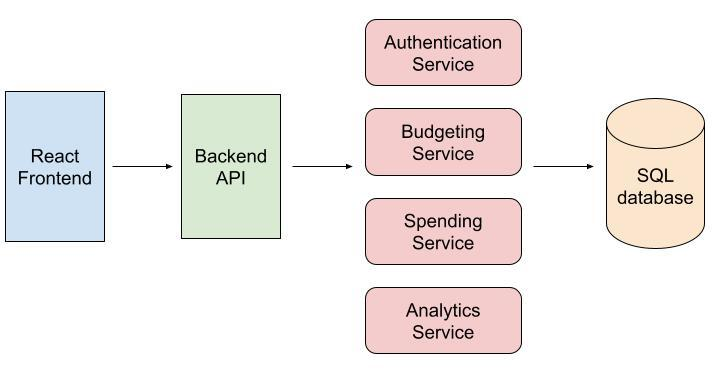

# Personal Finance Application

## Purpose

The **Personal Finance Application** is designed to help users manage their personal finances on a month-to-month basis. With a simple and intuitive interface, users can create budgets, track their spending, and monitor when they exceed their budget. The application aims to provide users with insights into their financial habits and improve their budgeting skills.

## Key Features

- **Create and Edit Monthly Budgets**: Users can set up their budgets for each month.
- **Log and Categorize Spending**: Track spending by date, amount, and category (e.g., food, transportation).
- **Monitor Budget Overruns**: Receive feedback when spending exceeds the allocated budget for any category or overall.
- **View Spending Reports**: Month-to-month reports displaying spending trends (stretch goal).

## User Requirements

- **Account Management**: Users can create an account, log in, and securely store their financial data.
- **Intuitive Interface**: A simple and user-friendly interface to ensure smooth navigation.
- **Budget Notifications**: Provide users with feedback when they exceed their budget.

## Technical Requirements

- **Backend**: Java for business logic.
- **Database**: MySQL or a similar relational database to store user data.
- **Frontend**: React.js for building the user interface.
- **API**: A RESTful API using Java and Spring Boot for communication between the frontend and backend.

## Database Models

The application will consist of the following key models:

| **Table**      | **Column Name** | **Type**         | **Description**                                |
| -------------- | --------------- | ---------------- | ---------------------------------------------- |
| **Users**      | `id`            | Primary Key      | Unique identifier for each user                |
|                | `name`          | String           | Full name of the user                          |
|                | `username`      | String           | Username for login                             |
|                | `password`      | Encrypted String | User's encrypted password                      |
|                | `email`         | String           | User's email address                           |
| **Budgets**    | `id`            | Primary Key      | Unique identifier for each budget              |
|                | `user_id`       | Foreign Key      | References `user_id` in `Users` table          |
|                | `category_id`   | Foreign Key      | References `category_id` in `Categories` table |
|                | `month`         | Date             | Budget month (e.g., '2024-09')                 |
|                | `total_budget`  | Float            | Total budget amount for the month              |
| **Spending**   | `id`            | Primary Key      | Unique identifier for each spending entry      |
|                | `user_id`       | Foreign Key      | References `user_id` in `Users` table          |
|                | `category_id`   | Foreign Key      | References `category_id` in `Categories` table |
|                | `amount_spent`  | Float            | Amount spent in a category                     |
|                | `date`          | Date             | Date of the spending (e.g., '2024-09-18')      |
| **Categories** | `id`            | Primary Key      | Unique identifier for each category            |
|                | `user_id`       | Foreign Key      | References `user_id` in `Users` table          |
|                | `name`          | String           | Name of the spending category (e.g., 'Food')   |

## Application Architecture

The application will follow a standard client-server architecture:

- **Frontend**: React.js for user interactions.
- **Backend**: Java and Spring Boot to handle business logic and data processing.
- **Database**: MySQL to store user information, budgets, and spending data.
- **API**: RESTful endpoints to facilitate frontend-backend communication.

## Error Handling Considerations

- **Input Validation**: Ensure data entered by users is validated before submission (e.g., proper date formats, valid spending amounts).
